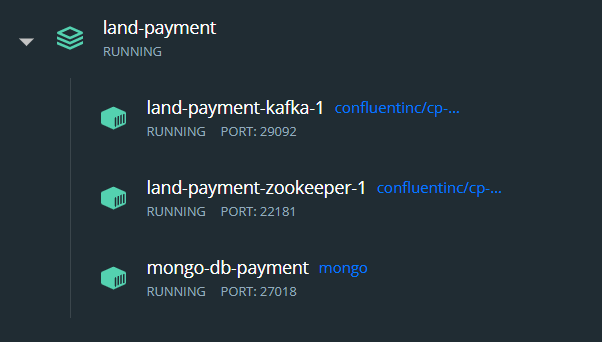

# land-payment


This repository contains the *PaymentService* microservice.

It is in charge of:

- processing payment requests arriving in a kafka topic
- saving transactions in its private DB
- sending the output of payment requests in another kafka topic


## Launching the service

Specifications for building the containers for Kafka, Apache Zookeper and the MongoDB instance are all contained in the `docker-compose.yml` file, so all you have to do before launching the app is to run, from the root directory:

```bash
docker compose up
```

If you use Docker Desktop you should see something like this:



## Communication through Kafka
### Sending Payment Requests

The kafka topic for placing payment requests is: `payment-requests`

Messages should adhere to the following schema:

```kotlin
data class PaymentRequest(
    val orderId: String,
    val userId: Long,
    val amount: Double,
    val ticketId: String,
    val creditCardNumber: String,
    val creditCardExpirationDate: String,
    val creditCardCVV: String,
    val cardHolder: String
)
```

### Consuming Payment Outcomes

The kafka topic for polling for payment outcomes is: `payment-outcomes`

Message Consumers should expect this schema:

```kotlin
data class PaymentOutcome(
    val orderId: String,
    val paymentSuccessful: Boolean
)
```


## REST API

The microservice offers additional functionalities by means of a REST API.

It exposes the following endpoints:

---

- GET `/transactions`

    - Request headers: *Authentication (Bearer Token)*
    - Response status: `200 OK`, `401 Unauthorized` or `500 Internal Server Error`
    - Response body: *a JSON list of all transactions of ONLY the current user*

      ```json
      [
        {
          "id": "62913be22164a31ac0fe2cf6",
          "userId": 1,
          "orderId": "e0b4c70d-2dbb-4a96-86be-9c97645f25a8",
          "amount": 59.3,
          "status": "FAILED",
          "start_timestamp": "2022-05-27T21:00:18.784457600Z",
          "end_timestamp": "2022-05-27T21:00:28.806880900Z"
        },
        {
          "id": "62913bf62164a31ac0fe2cf7",
          "userId": 1,
          "orderId": "6d859358-16f7-4364-a257-98b825b2fb7d",
          "amount": 59.3,
          "status": "SUCCESSFUL",
          "start_timestamp": "2022-05-27T21:00:38.952663900Z",
          "end_timestamp": "2022-05-27T21:00:48.963421300Z"
          },
          ...
      ]

---

- GET `/admin/transactions`

    - Request headers: *Authentication (Bearer Token)*
    - Response status: `200 OK`, `401 Unauthorized` or `500 Internal Server Error`
    - Request body: *a JSON object with the transactions of ALL users*

      ```json
      [
        {
          "id": "62913be22164a31ac0fe2cf6",
          "userId": 1,
          "orderId": "e0b4c70d-2dbb-4a96-86be-9c97645f25a8",
          "amount": 59.3,
          "status": "FAILED",
          "start_timestamp": "2022-05-27T21:00:18.784457600Z",
          "end_timestamp": "2022-05-27T21:00:28.806880900Z"
        },
        {
          "id": "62913bf62164a31ac0fe2cf7",
          "userId": 2,
          "orderId": "6d859358-16f7-4364-a257-98b825b2fb7d",
          "amount": 59.3,
          "status": "SUCCESSFUL",
          "start_timestamp": "2022-05-27T21:00:38.952663900Z",
          "end_timestamp": "2022-05-27T21:00:48.963421300Z"
          },
         {
          "id": "62913c7f178e7a2998336701",
          "userId": 3,
          "orderId": "4aab24a0-769e-48ff-a117-6eb80eb34e15",
          "amount": 59.3,
          "status": "FAILED",
          "start_timestamp": "2022-05-27T21:02:55.000820300Z",
          "end_timestamp": "2022-05-27T21:03:05.245098300Z"
         }
      ]

---
